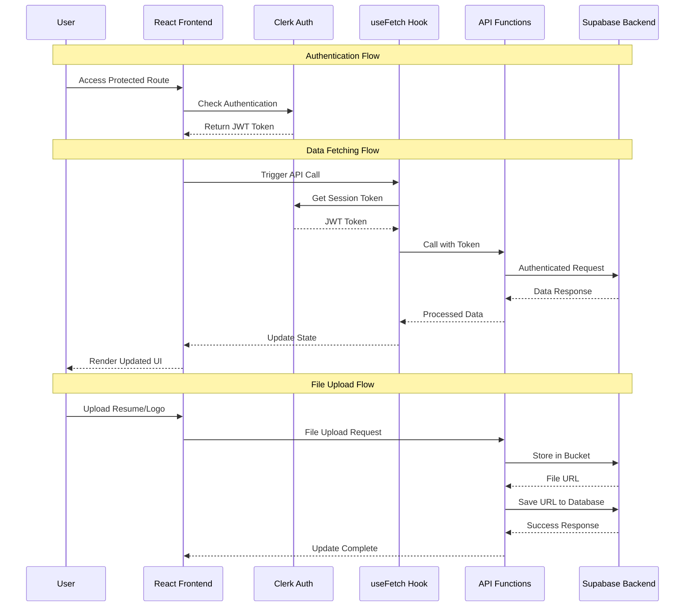
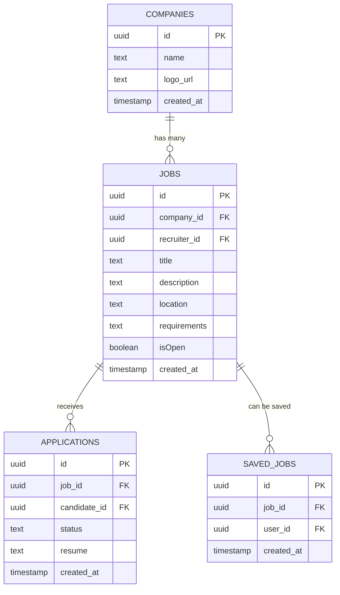

# JobSeek - AI-Powered Job Search Platform

[](https://job-seek-umber.vercel.app/)

JobSeek is an intelligent job search platform that leverages AI to help users find their dream jobs more effectively. The platform provides personalized job recommendations, resume analysis, and smart matching algorithms.


## 🚀 Live Demo

#### Visit our live application at: [JOB-SEEK](https://job-seek-umber.vercel.app/)

## 🛠️ Tech Stack

### Frontend
- React.js (Vite) - Fast and modern frontend framework
- Tailwind CSS - Utility-first CSS framework
- Clerk - Authentication and user management
- Zod - TypeScript-first schema validation

### Backend
- Supabase - Backend as a Service (BaaS)
  - Database
  - Authentication
  - RLS Policy Secured database
  - Storage

<!-- ### AI Integration
- Hugging Face - Mistral-7B-Instruct-v0.2
  - Job matching and recommendations
  - Semantic search capabilities
  - Natural language processing -->

## 🛠️ Setup Instructions

1. Clone the repository:
```bash
git clone https://github.com/SjxSubham/JOB-SEEK

```

2. Install dependencies:
```bash
npm install
```

3. Environment Setup:
   - Copy `.env.sample` to `.env`
   - Add your own API keys and configuration values
   - Required environment variables:
     - `VITE_SUPABASE_URL`: Your Supabase project URL
     - `VITE_SUPABASE_ANON_KEY`: Your Supabase anonymous key
     - `VITE_CLERK_PUBLISHABLE_KEY`: Your Clerk publishable key
     - `VITE_HUGGINGFACE_API_TOKEN`: Your Hugging Face API token
     - Other configuration variables as specified in `.env.sample`

4. Run the development server:
```bash
npm run dev
```

5. Build for production:
```bash
npm run build
npm preview
```

## 🤖 AI Integration and Job Matching

### AI Job Recommendation Feature

The AI Job Recommendation feature uses the Mistral-7B-Instruct-v0.2 model from Hugging Face to provide personalized job matches based on user profiles. Here's how it works: (work is still going on...)

### Frontend Implementation
- Located in `src/components/AIJobRecommendation.tsx`
- Collects user profile data including:
  - Skills
  - Years of experience
  - Preferred location
  - Remote work preference
  - Salary expectations
  - Job type preferences
  - Education background
- Displays job matches in a clean card layout with:
  - Job title and company
  - Match score
  - Job description
  - Required skills

### Backend Implementation
- Uses Hugging Face's API with Mistral-7B-Instruct-v0.2 model
- Located in `src/services/aiService.ts`
- Processes user profile data and generates a structured prompt
- Returns top 3 job matches with match scores and relevant details

### Environment Setup
1. Add your Hugging Face API key to `.env`:
```
VITE_HUGGINGFACE_API_KEY=your_api_key_here
```

### Usage
1. Navigate to the AI Job Recommendation section
2. Fill in your profile details
3. Click "Find My Matches"
4. View your personalized job recommendations

### Technical Details
- The AI model analyzes the user profile and generates job matches based on:
  - Skill compatibility
  - Experience level
  - Location preferences
  - Salary expectations
  - Job type preferences
- Each match includes a match score (0-1) indicating the relevance
- The response is formatted in JSON and processed for display

## 📚 API Documentation

### Authentication

The platform uses Clerk for authentication. To access protected endpoints, include the session token in the request headers:

```javascript
headers: {
  'Authorization': `Bearer ${sessionToken}`,
  'Content-Type': 'application/json'
}
```

### Endpoints


#### Jobs

- `GET /api/jobs` - Get all jobs
- `GET /api/jobs/:id` - Get job by ID
- `POST /api/jobs` - Create new job
- `PUT /api/jobs/:id` - Update job
- `DELETE /api/jobs/:id` - Delete job

#### Companies

- `GET /api/companies` - Get all companies
- `GET /api/companies/:id` - Get company by ID
- `POST /api/companies` - Create new company
- `PUT /api/companies/:id` - Update company
- `DELETE /api/companies/:id` - Delete company

#### Users

- `GET /api/users/profile` - Get user profile
- `PUT /api/users/profile` - Update user profile
- `GET /api/users/saved-jobs` - Get user's saved jobs
- `POST /api/users/saved-jobs/:jobId` - Save a job
- `DELETE /api/users/saved-jobs/:jobId` - Remove a saved job

### RESTful endpoint for querying and managing your database
#### URL - https://wzmpiaqjnegnitfnahue.supabase.co

## 🏗️ Code Architecture

### Project Architecture Diagram

```mermaid
graph TB
    %% Frontend Layer
    subgraph "Frontend (React.js + Vite)"
        A[App.jsx<br/>Router Configuration] --> B[AppLayout<br/>Header + Footer]
        B --> C[Protected Routes]
        C --> D[Pages]
        C --> E[Components]
        
        D --> D1[Landing Page]
        D --> D2[Job Listing]
        D --> D3[Job Details]
        D --> D4[Post Job]
        D --> D5[My Jobs]
        D --> D6[Saved Jobs]
        D --> D7[Onboarding]
        
        E --> E1[Job Card]
        E --> E2[Application Card]
        E --> E3[Company Drawer]
        E --> E4[Apply Job Form]
        E --> E5[UI Components<br/>shadcn/ui]
    end

    %% Authentication Layer
    subgraph "Authentication"
        F[Clerk Auth] --> F1[JWT Tokens]
        F --> F2[User Roles<br/>Candidate/Recruiter]
        F --> F3[Protected Routes]
    end

    %% State Management & API Layer
    subgraph "State & API Layer"
        G[Custom Hooks] --> G1[useFetch Hook]
        G1 --> G2[API Functions]
        
        G2 --> G2A[apiJobs.js]
        G2 --> G2B[apiCompanies.js]
        G2 --> G2C[apiApplication.js]
    end

    %% Backend Services
    subgraph "Backend (Supabase BaaS)"
        H[Supabase Client] --> H1[PostgreSQL Database]
        H --> H2[Storage Buckets]
        H --> H3[Row Level Security]
        H --> H4[Real-time Subscriptions]
        
        H1 --> H1A[Jobs Table]
        H1 --> H1B[Companies Table]
        H1 --> H1C[Applications Table]
        H1 --> H1D[Saved Jobs Table]
        
        H2 --> H2A[Company Logos]
        H2 --> H2B[Resume Files]
    end

    %% External Services
    subgraph "External Services"
        I[Clerk Dashboard<br/>User Management]
        J[Vercel<br/>Deployment]
    end

    %% Data Flow Connections
    A -.-> F
    C -.-> F1
    D -.-> G1
    E -.-> G1
    G1 -.-> F1
    G2 -.-> H
    F -.-> I
    H -.-> H3
    
    %% Styling & Utils
    subgraph "Styling & Configuration"
        K[Tailwind CSS]
        L[Zod Validation]
        M[React Hook Form]
        N[Vite Build Tool]
    end

    E5 -.-> K
    E4 -.-> L
    E4 -.-> M
    A -.-> N

    %% Styling
    classDef frontend fill:#e1f5fe,stroke:#01579b,stroke-width:2px
    classDef auth fill:#f3e5f5,stroke:#4a148c,stroke-width:2px
    classDef backend fill:#e8f5e8,stroke:#1b5e20,stroke-width:2px
    classDef external fill:#fff3e0,stroke:#e65100,stroke-width:2px
    classDef config fill:#fce4ec,stroke:#880e4f,stroke-width:2px

    class A,B,C,D,D1,D2,D3,D4,D5,D6,D7,E,E1,E2,E3,E4,E5 frontend
    class F,F1,F2,F3 auth
    class G,G1,G2,G2A,G2B,G2C,H,H1,H2,H3,H4,H1A,H1B,H1C,H1D,H2A,H2B backend
    class I,J external
    class K,L,M,N config
```



### Data Flow Architecture



### Frontend Structure
```
├── public/    # static assets
├── src/
│   ├── components/     # Reusable UI components
│   │   ├── ui/    # Job listing card component
│   ├── data/          # JSON Data
│   ├── pages/         # React pages and routing
│   ├── hooks/         # fectching database.data
│   ├── styles/        # Global styles and Tailwind config
│   ├── utils/         # Helper functions and utilities
│   ├── api/           # Supabase and API integration
|   ├── lib/
│   └── types/         # TypeScript type definitions
├── .env.sample        # Environment variables template
└── vite.config.ts     # Vite configuration
```

### Key Technologies & Architecture Patterns

#### Frontend Architecture
- **React.js (Vite)** - Component-based UI with fast HMR development
- **React Router** - Client-side routing with nested routes and protection
- **Custom Hooks** - Reusable logic for API calls and state management
- **Component Composition** - Modular UI components with shadcn/ui foundation

#### Authentication & Security
- **Clerk** - Complete authentication solution with JWT tokens
- **Role-based Access Control** - Candidate and Recruiter user types
- **Protected Routes** - Route-level authentication guards
- **Row Level Security (RLS)** - Database-level security policies

#### Backend Integration
- **Supabase BaaS** - Complete backend solution with:
  - PostgreSQL database with real-time capabilities
  - Authentication integration with Clerk
  - File storage for resumes and company logos
  - Automatic API generation with TypeScript support

#### State Management
- **React Hooks** - useState, useEffect for local component state
- **Custom useFetch Hook** - Centralized API call management
- **Context API** - Theme provider for dark/light mode

#### Styling & UI
- **Tailwind CSS** - Utility-first CSS framework
- **shadcn/ui** - High-quality, accessible component library
- **Radix UI** - Unstyled, accessible UI primitives
- **Responsive Design** - Mobile-first approach

### Database Schema & API Structure

#### Core Database Tables



#### API Endpoints Structure

| Module | Endpoint | Description |
|--------|----------|-------------|
| **Jobs** | `getJobs()` | Fetch jobs with filters (location, company, search) |
| | `getSingleJob()` | Get detailed job information |
| | `addNewJob()` | Create new job posting (recruiter) |
| | `getMyJobs()` | Get recruiter's posted jobs |
| | `updateHiringStatus()` | Toggle job open/closed status |
| | `deleteJob()` | Remove job posting |
| | `saveJob()` | Add/remove job from saved list |
| **Companies** | `getCompanies()` | Fetch all companies |
| | `addNewCompany()` | Create company profile with logo |
| **Applications** | `applyToJob()` | Submit job application with resume |
| | `getApplications()` | Get candidate's applications |
| | `updateApplicationStatus()` | Update application status (recruiter) |


## ⚖️ Trade-offs and Assumptions

### Trade-offs
1. **Performance vs. Features**
   - Real-time AI analysis may impact response times
   - Caching strategies implemented for optimization
   - Supabase real-time subscriptions for live updates
   - Rate limiting for AI API calls

2. **Scalability**
   - Supabase handles database scaling
   - Clerk manages authentication scaling
   - AI service rate limits considered in design
   - Ready for horizontal scaling if needed

### Assumptions
1. **User Behavior**
   - Users will provide accurate profile information
   - Regular updates to job preferences
   - Secure authentication through Clerk
   - Willing to wait for AI processing

2. **Data Quality**
   - Job listings are up-to-date
   - Resume data is in supported formats
   - Data validation through Zod schemas
   - AI model responses are reliable

## 📝 License

This project is licensed under the MIT License - see the LICENSE file for details.

## 🤝 Contributing

Contributions are welcome! Please read our contributing guidelines before submitting pull requests.

## 📧 [Feedback](https://feed-x-widget.vercel.app/?projectId=29&projectName=JOB-SEEK)

For support or inquiries, Feedback please reach out to - [Here](https://feed-x-widget.vercel.app/?projectId=29&projectName=JOB-SEEK)
